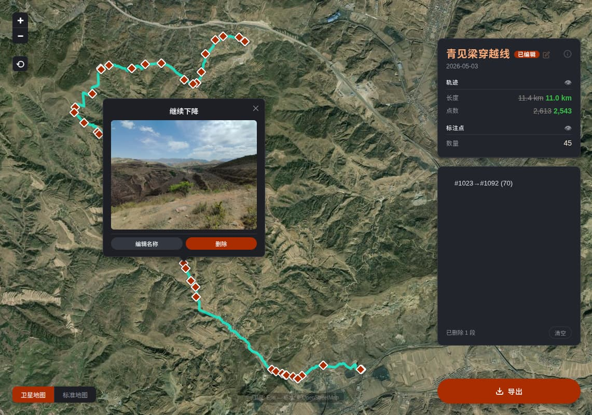

# 两步路轨迹编辑器

一个基于 Web 的 KMZ 轨迹编辑工具，支持删除轨迹段、管理标注点、重命名轨迹，并导出编辑后的 KMZ 文件。适用于编辑两步路 App 导出的轨迹文件。



## 快速开始

```bash
python3 -m kmz_editor.server
```

启动后访问 http://127.0.0.1:8899，将 .kmz 文件拖入地图即可开始编辑。

依赖：Python 3 + Flask。无需安装其他依赖，Leaflet 已内置在 `static/lib/` 目录中。

## 功能

- **轨迹编辑** — 在地图上依次点击两个轨迹点，选中一段轨迹后删除
- **标注点管理** — 编辑或删除轨迹中的标注点（waypoint）
- **轨迹重命名** — 点击轨迹名称即可修改
- **地图切换** — 卫星地图（Esri）与标准地图（OpenStreetMap）一键切换
- **拖放上传** — 将 .kmz 文件拖入地图即可替换当前轨迹
- **导出 KMZ** — 编辑完成后导出包含媒体文件的完整 .kmz
- **编辑撤销** — 支持撤销单段删除或清空全部删除
- **数据持久化** — 删除记录和标注点编辑自动保存到浏览器本地存储

## 技术栈

- 后端：Python 3 + Flask
- 前端：原生 JavaScript + Leaflet
- 数据：KML / KMZ（ZIP 压缩的 KML）
